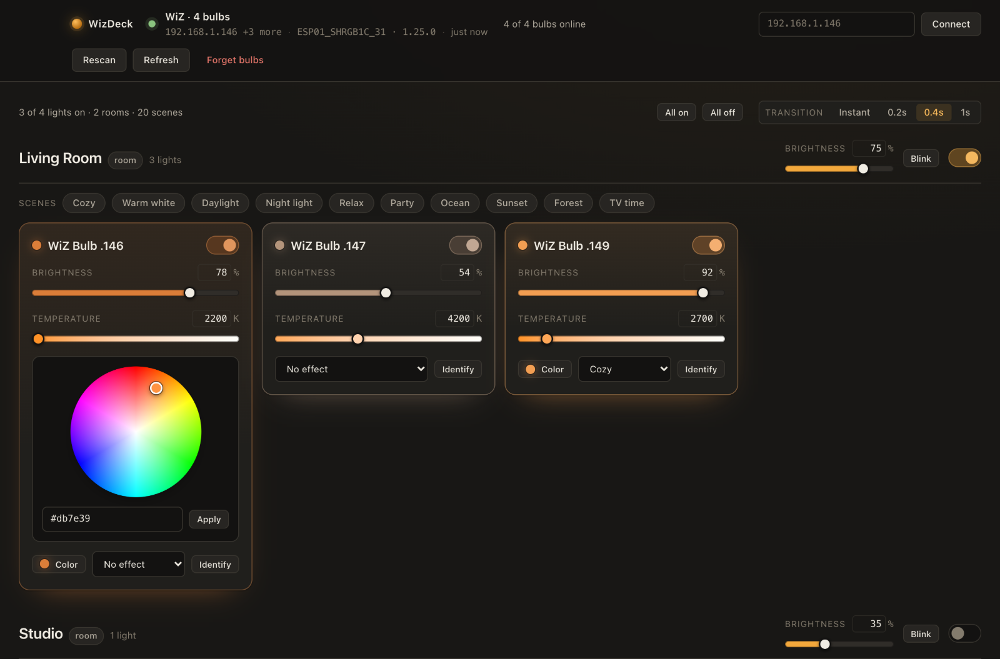

# WizDeck

[](#install-as-a-desktop-app)
[](https://www.electronjs.org/)
[](https://nodejs.org/)
[](#protocol-notes)
[](#project-layout)
[](LICENSE)

Desktop control for WiZ smart bulbs. Finds them on your LAN by MAC address — so a
DHCP lease change does not break anything — and gives you full control of power,
brightness, colour, colour temperature, scenes and rooms.

Local only: plain JSON over UDP port 38899. No cloud, no account, no pairing, no
runtime dependencies beyond Electron itself.



<sub>Two rooms with four bulbs: group masters, per-bulb brightness/kelvin, the HS
wheel with a hex field, and 10 scene chips per room.</sub>

## Contents

- [Requirements](#requirements)
- [Run from source](#run-from-source)
- [Install as a desktop app](#install-as-a-desktop-app)
- [Scripts](#scripts)
- [CLI flags and state file](#cli-flags-and-state-file)
- [What you can control](#what-you-can-control)
- [How discovery survives DHCP](#how-discovery-survives-dhcp)
- [Verify against your own hardware](#verify-against-your-own-hardware)
- [Protocol notes](#protocol-notes)
- [Project layout](#project-layout)
- [Troubleshooting](#troubleshooting)

## Requirements

- macOS (Apple silicon or Intel), Windows 10/11, or Linux (x64/arm64)
- Node 20 or newer, and npm
- Bulbs and computer on the same Wi-Fi/subnet
- "Local control" left enabled in the WiZ app (it is on by default)

## Run from source

```bash
git clone https://github.com/silencesilja/WizDeck.git
cd WizDeck
npm install
npm start
```

## Install as a desktop app

`@electron/packager` turns the source into a self-contained bundle; the installers
then put it where your desktop looks for applications. Bundles land in `dist/`.

### macOS — `/Applications` + Spotlight

```bash
npm install
npm run install:app
```

Builds `WizDeck.app` for the host architecture, ad-hoc signs it (required on
Apple silicon after the bundle is modified), copies it to `/Applications`, and
forces a Spotlight reindex. Then `Cmd+Space` → `WizDeck`.

Build without installing:

```bash
npm run package:mac      # dist/WizDeck-darwin-<arch>/WizDeck.app
```

The app is signed ad hoc, not notarised. That is fine for a bundle you build
yourself; it is *not* enough to hand the `.app` to someone else over the
internet, where Gatekeeper will quarantine it.

### Linux — applications menu

```bash
npm install
npm run install:linux
```

Installs to `~/.local/opt/WizDeck`, drops a 512px icon into
`~/.local/share/icons/hicolor/512x512/apps/`, writes
`~/.local/share/applications/wizdeck.desktop`, and refreshes the desktop/icon
caches. No root, no package manager; search your launcher for "WizDeck".

Uninstall:

```bash
rm -rf ~/.local/opt/WizDeck ~/.local/share/applications/wizdeck.desktop \
       ~/.local/share/icons/hicolor/512x512/apps/wizdeck.png
```

Build without installing:

```bash
npm run package:linux    # dist/WizDeck-linux-<arch>/WizDeck
```

### Windows — Start Menu

```powershell
npm install
npm run package:win      # dist\WizDeck-win32-x64\WizDeck.exe
```

`WizDeck.exe` is already runnable from `dist\`. To keep it around and get a Start
Menu entry, copy the folder somewhere permanent and make a shortcut (PowerShell,
no admin rights needed):

```powershell
$dest = "$env:LOCALAPPDATA\Programs\WizDeck"
Remove-Item -Recurse -Force $dest -ErrorAction SilentlyContinue
Copy-Item -Recurse -Force .\dist\WizDeck-win32-x64 $dest
$link = "$env:APPDATA\Microsoft\Windows\Start Menu\Programs\WizDeck.lnk"
$s = (New-Object -ComObject WScript.Shell).CreateShortcut($link)
$s.TargetPath = "$dest\WizDeck.exe"
$s.IconLocation = "$dest\WizDeck.exe"
$s.Save()
```

Uninstall by deleting those two paths. There is no repo script for this step —
unlike the macOS and Linux installers it has not been exercised here.

### Cross-building

`npm run package` builds for the host; `--platform`/`--arch` build for anything
else, e.g. from a Mac for a Raspberry Pi:

```bash
node tools/package.mjs --platform=linux --arch=arm64
```

| Host → target | Result |
| --- | --- |
| any → linux | complete bundle, icon included |
| any → win32 | complete bundle; the **.exe icon** needs [Wine](https://www.winehq.org/) on a non-Windows host — without it the build still succeeds and says so |
| any → darwin | complete bundle, but macOS will refuse to launch it until it is signed **on a Mac**: `codesign --force --deep --sign - WizDeck.app` |

Icons are generated by `tools/make-icon.mjs`, which rasterises the artwork and
writes `.png`, `.icns` and `.ico` using only Node built-ins — no ImageMagick, no
`sips`/`iconutil`, so every target's icon can be produced on every host.

## Scripts

| script | what it does |
| --- | --- |
| `npm start` | run from source |
| `npm run verify` | hardware test against a real bulb (see below) |
| `npm run package` | build a bundle for the host platform |
| `npm run package:mac` / `:win` / `:linux` | build a bundle for that platform |
| `npm run install:app` | build + install to `/Applications` (macOS) |
| `npm run install:linux` | build + install to `~/.local` with a desktop entry |
| `npm run icon` | regenerate `build/icon.png`, `.icns`, `.ico` |

## CLI flags and state file

When running from source:

- `--bulb=192.168.1.146` pins one bulb and skips discovery
- `--store=<path>` relocates saved state

Default state file (bulbs keyed by MAC, plus the remembered transition time):

| OS | path |
| --- | --- |
| macOS | `~/Library/Application Support/WizDeck/wiz.json` |
| Windows | `%APPDATA%\WizDeck\wiz.json` |
| Linux | `~/.config/WizDeck/wiz.json` |

## What you can control

- **Power** per bulb, per room, and **All on / All off** for every reachable bulb
- **Brightness** 0–100 %, clamped up to the bulb's own minimum dim level (10 % on
  most models — asking for less is silently refused by the firmware)
- **Colour** via HS wheel or `#rrggbb` field
- **Colour temperature** across the range the bulb reports (2200–6500 K on
  `ESP24_SHRGBC_01`), with a real kelvin gradient on the slider
- **Exact numbers by hand**: every slider's readout is also an input — type
  `4200` into the temperature box, or `40` into brightness, and press Enter.
  Arrow keys step (50 K / 1 %), Shift+arrows step coarse (500 K / 10 %), Escape
  reverts, out-of-range values clamp to what the bulb accepts.
- **Transition time** (instant … 1 s) applies to every write and is remembered
  between launches
- **All 35 built-in WiZ scenes** (Ocean, Cozy, Party, Candlelight, …); animated
  ones also take a speed
- **Rooms** grouped by the bulb's own `roomId`, with 10 scene chips per room
- **Identify** — pulses the bulb so you can tell which one it is
- Live state: the app registers for the bulb's `syncPilot` pushes, so changes
  made in the WiZ app or at a wall switch show up here too

Capabilities are read from the hardware (`getModelConfig` / `getSystemConfig`), so
a white-only bulb simply does not render colour controls.

## How discovery survives DHCP

Bulbs are keyed by **MAC**, never by IP.

1. Known addresses from `wiz.json` are probed directly.
2. A `registration` + `getPilot` broadcast goes out on every interface.
3. Every host on the local subnet is unicast-probed (~253 datagrams, ~2.5 s).

macOS routinely drops the replies to a `255.255.255.255` probe, so in practice
step 3 is what finds bulbs on a Mac; the broadcast is kept because it is free and
works elsewhere. Anything that answers with a matching MAC is adopted at its new
address and re-persisted. A rescan runs every 20 s while a known bulb is missing,
and on demand from the **Rescan** button or `Cmd/Ctrl+R`.

## Verify against your own hardware

```bash
npm run verify          # or: node tools/verify.mjs 192.168.1.146
```

Drives the real engine against a real bulb and confirms **every** write by reading
the bulb back over raw UDP, never through the app's cache: brightness, dim-floor
clamping, hex → RGB, kelvin → temp, out-of-range clamping, scenes with speed,
group writes, scene recall, identify, external-change propagation, unreachable
handling, and rediscovery by MAC. The bulb's original state is restored at the
end. 33 checks; exits non-zero on any failure.

## Protocol notes

Learned from `ESP24_SHRGBC_01` firmware 1.38.0 and enforced in `buildPilot()`:

- `sceneId` may **not** be sent together with `r/g/b` or `temp` — the bulb answers
  `-32602 Invalid params` and ignores the whole command.
- `c` / `w` (white channels) may not accompany RGB.
- Writing colour or temperature implicitly drops the bulb out of its scene.
- "No effect" has no wire representation, so leaving a scene re-asserts the
  current colour temperature.
- `dimming` below the model's `minDimLevel` is rejected; the app clamps instead.

## Project layout

```
src/main/main.js         Electron main: window, menu, IPC
src/preload.js           sandboxed bridge (contextIsolation, no node in renderer)
src/main/wiz/
  protocol.js            UDP transport, discovery, syncPilot listener, scene table
  engine.js              app state, capability model, patch → setPilot mapping
  color.js               hex/RGB/xy, kelvin ↔ mired, blackbody swatches
  store.js               atomic JSON state (bulbs keyed by MAC)
src/renderer/            vanilla HTML/CSS/JS UI, no framework, no build step
tools/verify.mjs         hardware test
tools/make-icon.mjs      dependency-free .png/.icns/.ico generator
tools/package.mjs        cross-platform bundle build
tools/install-macos.mjs  build + ad-hoc sign + install to /Applications
tools/install-linux.mjs  build + install to ~/.local with a .desktop entry
```

Only Node built-ins at runtime; Electron and the packager are the sole
devDependencies.

## Troubleshooting

- **No bulbs found** — confirm the bulb answers:
  ```bash
  echo -n '{"method":"getPilot","params":{}}' | nc -u -w1 192.168.1.146 38899
  ```
  (Windows: `Test-NetConnection` cannot do UDP; use the app's **Rescan** or run
  the one-liner from WSL.) If that is silent the bulb is on another subnet/VLAN
  or off.
- **Found but not controllable** — some routers block client-to-client UDP
  ("AP isolation"); turn it off.
- **Name shows as `WiZ Bulb .146`** — WiZ does not expose the name you set in its
  app over the local protocol, only MAC/room ids.
- **Firewall prompt on first run** — the app listens on UDP 38900 for state
  pushes. Allow it (macOS prompt, Windows Defender dialog, or
  `sudo ufw allow 38900/udp` on Linux), otherwise the UI falls back to polling.
- **macOS: "WizDeck is damaged" or nothing happens** — the bundle was modified
  after Electron signed it (`npm run install:app` re-signs it for you). Manually:
  ```bash
  codesign --force --deep --sign - /Applications/WizDeck.app
  ```
- **Linux: app not in the menu** — some desktops cache aggressively; log out and
  back in, or run `update-desktop-database ~/.local/share/applications`.

## License

[MIT](LICENSE). Binaries you build bundle Electron and Chromium, which carry
their own licences — `@electron/packager` copies `LICENSE` and
`LICENSES.chromium.html` into every bundle, so redistributing one keeps those
notices intact.

WiZ is a trademark of Signify. This project is unaffiliated with, and not
endorsed by, Signify; it just speaks the bulbs' local UDP protocol.
